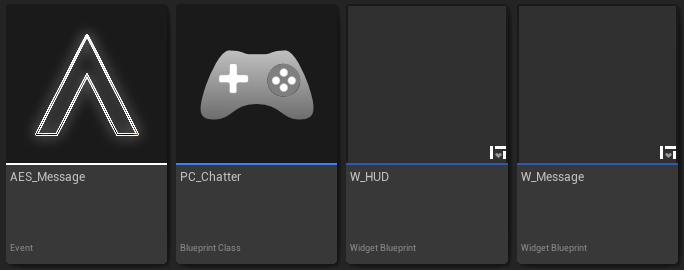

## 1. Creating Required Classes

Create the following classes:

- ``
- `AES_Message` - This is the Event and payload we'll be sending to other clients when we send a message.
- `PC_Chatter` - A player controller that we'll be using to send the messages to the server in order to replicate the message to other clients.
- `W_HUD` - A container widget to hold our chat box. This chat box will contain `W_Message` widgets as they come in.
- `W_Message` - A message widget that will contain the text of the message.

