# Dragon Spawn 🐉

In this little example, we're going to register our players for an event that fires when a Dragon spawns! 

## 1. Create an Event 📩

Right click in your content browser and navigate to `AES` -> `Event`.

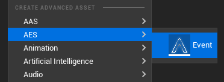

This will generate a custom `AES Event` asset.

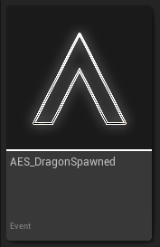

This will also create a `Gameplay Tag` matching the `AES Event` name in the format of `AES.DragonSpawned`. 

?>TIP: If you delete this event and the `Gameplay Tag` is not being used anywhere else, it will automatically delete the tag as well.

!>WARNING: Do not manually delete `AES Gameplay Tags`! If you do, _make sure that the event does not exist_ otherwise you will cause a mismatch between events <-> gameplay tags and you'll end up with unexpected behavior!

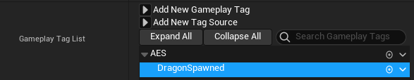

## 2. Add Payload Properties

Open the `AES_DragonSpawned` event and add any properties as you normally would. In our example we're going to add `Dragon Level` and `Dragon Location`.

We make sure any properties that we want to be exposed when this event is generated are set to `Instance Editable` and `Expose on Spawn`.

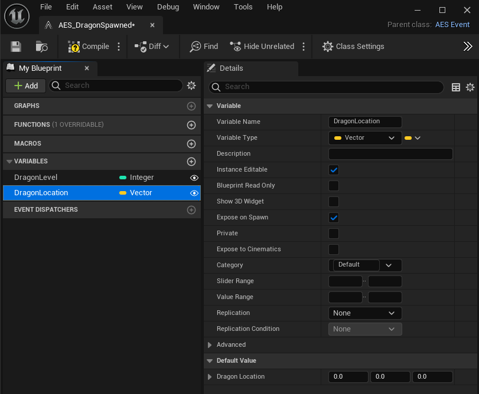

## 3. Generate an Identity for Players 🤺

Generate a unique `Identity` for any actor, component, system or object that may send or receive events. In our case, we're generating an ID for our `Dragon Slayer` player pawn! 

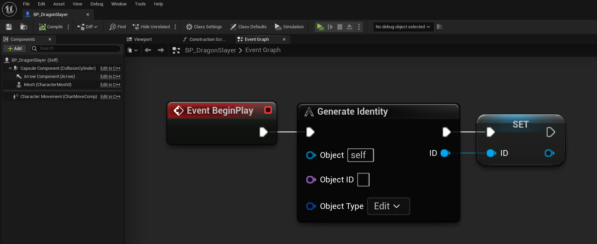

In the diagram above, assuming this is a class that is replicated, this will generate `2 Identities`, one for the `Client` side and one for the `Server` side.

?>TIP: This `Identity` is not replicated and will be uniquely generated if this is called on the `Server` vs. the `Client`. This allows the `Event Manager` to handle these events in a much more efficient manner by keeping `Server` events separate from `Client` events.

## 4. Register for the Broadcast Event ✒

Now that we've generated an `Identity`, we can use it to talk to the `Event Manager`.

Here we register for a `Broadcast` event by passing in a `Registration` structure that consists of the `AES Event` that we want to listen for and the `delegate` we want to receive the callback on which in our case is `AES_DragonSpawned` and `OnBroadcastEvent`, respectively.

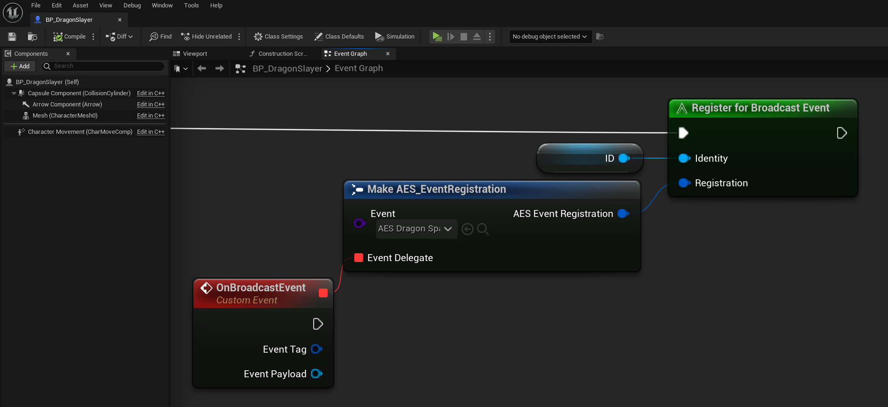

When the delegate gets called, we can determine which broadcast event was called based on the `Event Tag` that was automatically generated for us when we created `AES_EventSpawned`. 

We then cast to our `AES Event` type which will allow us to fetch the payload properties that were set when the event was broadcasted. See [Step 6. Spawn the Dragon! 🐲](#_6-spawn-the-dragon-🐲)

?>TIP: By designing it this way, we can handle all kinds of Broadcast events with a **single callback delegate or method**!

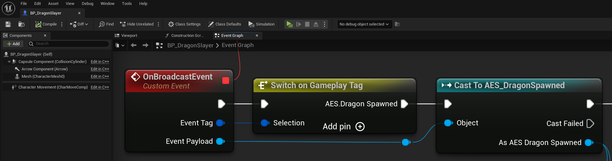

We fetch the data and simply print it out for this demo example.

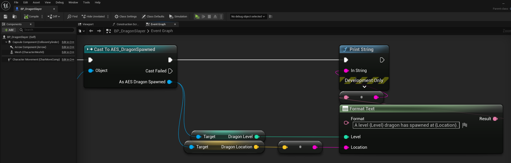

## 5. Broadcast the Event 📨

In our `Dragon` class, whenever the dragon spawns on `Begin Play` we generate an `Identity` for the dragon and then we use it to `Generate a Broadcast Event`.

As soon as the `AES_DragonSpawned` Event is selected, any exposed properties will appear and will give us a chance to set their values before the event is broadcasted to all listeners.

Here we're simply grabbing at random number between 60 and 100 for the dragon level and then grabbing the actor location as well.

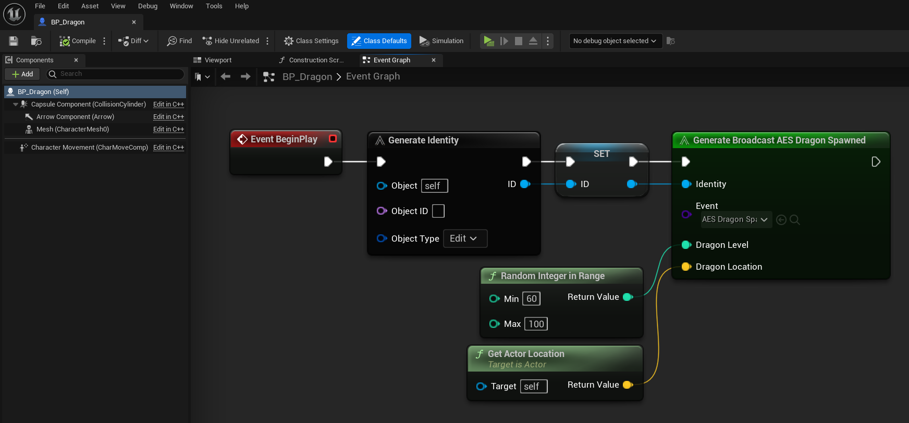

## 6. Spawn the Dragon! 🐲

This spawning would obviously be handled by whatever system you have in place that's responsible for spawning the dragon. 

In this example we're playing as a `Server` so we just use a hardcoded keypress to spawn a dragon on demand for demo purposes.

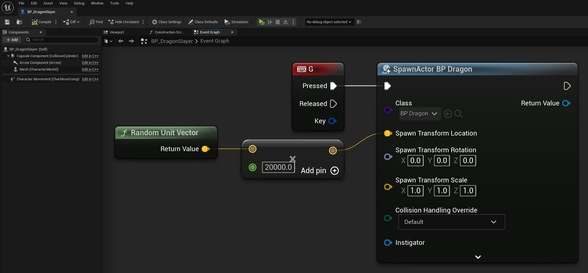

Now we mash our `G` key and say `GG` in the chat as all of these dragons head to the nearest town for a good ol' barbecue! 🥩🔥

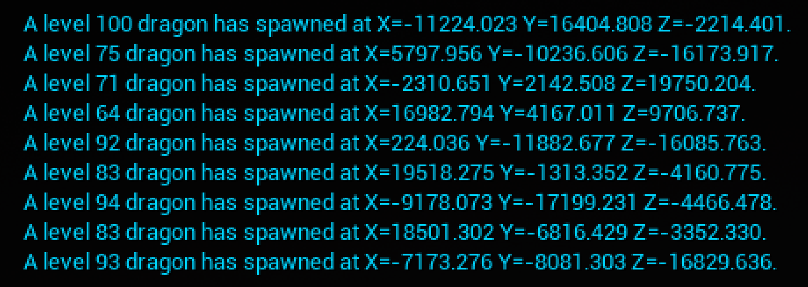