# Dragon Spawn 🐉

In this little example, we're going to register our players for an event that fires when a Dragon spawns! 

## 1. Create an Event 📩

Right click in your content browser and navigate to `AES` -> `Event`.

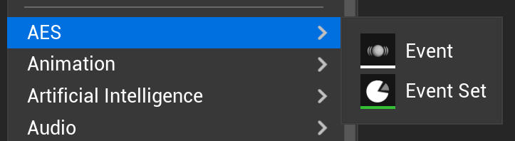

This will generate a custom `AES Event` asset.

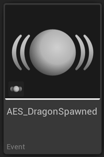

## 2. Add Payload Properties

Open the `AES_DragonSpawned` event and add any properties as you normally would. In our example we're going to add `Level` and `Location`.

We make sure any properties that we want to be exposed when this event is generated are set to `Instance Editable` and `Expose on Spawn`.

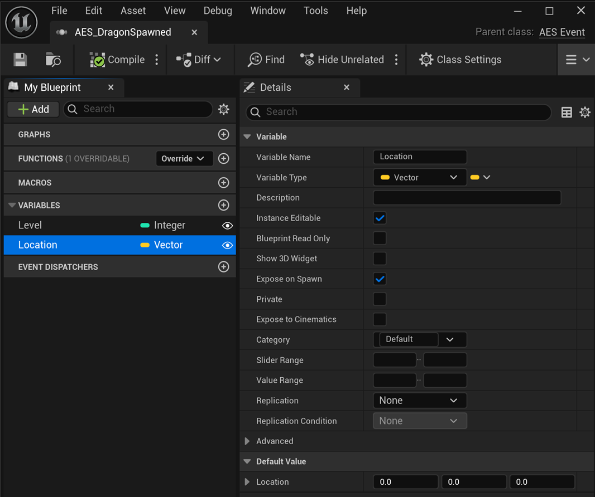

## 3. Generate an Identity for Players 🤺

Generate a unique `Identity` for any actor, component, system or object that may send or receive events. In our case, we're generating an Identity for our `Dragon Slayer` player pawn! 

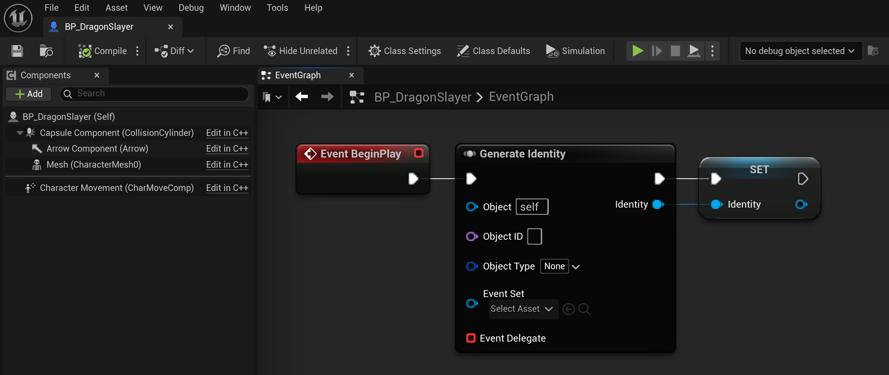

?>**NOTE**: This `Identity` is not replicated and will be uniquely generated if this is called on the `Server` vs. the `Client`. This allows the `Event Manager` to handle these events in a much more efficient manner by keeping `Server` events separate from `Client` events.

## 4. Register for the Broadcast Event ✒

Now that we've generated an `Identity`, we can use it to talk to the `Event Manager`.

Here we register for a `Broadcast` event by passing in a `Registration` that consists of the `AES Event` that we want to listen for and the `delegate` we want to call when the event happens. In our case the event is `AES_DragonSpawned` and the callback is our `OnDragonSpawned` custom event.

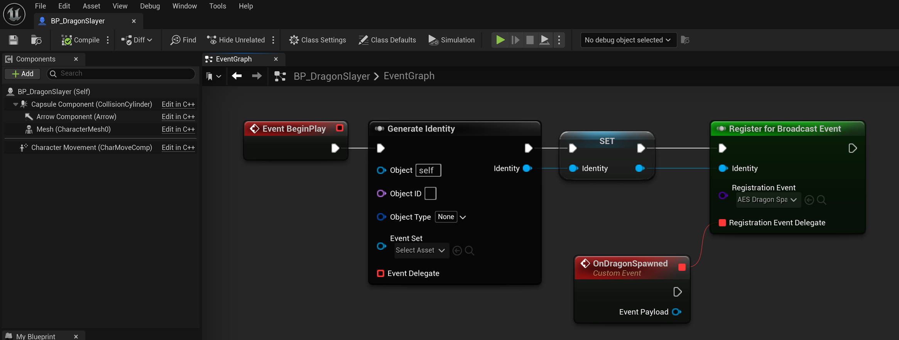

?>**NOTE**: You can either `Make AES Event Registration` or right click on the `Registration` pin and **split** so you don't have to have an extra node on your registrations.  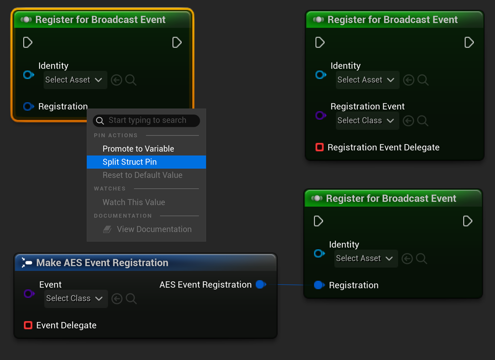

When the event is generated and this delegate gets called, we get a generic `AES Event Payload`. In order for us to get data from a specific event type, we can use 1 of 2 methods:

  #### 1) Cast Method (Single-Use Delegate)
  If this delegate (our `On Dragon Spawned` custom event) is only ever going to be used for this specific `AES_DragonSpawned` event, we can use a simple cast to get the data we need.
  
  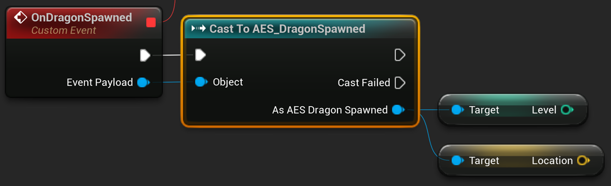

  #### 2) Switch on Event Method (Multi-Use Delegate)
  If we want this delegate to handle multiple events, we should rename it to something more generic like `Handle Events` and then we can use our custom `Switch on Event` node to get our data.
  
  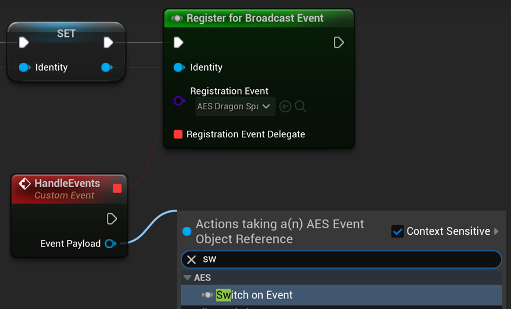

  Selecting the `Switch on Event` node will show some settings in the detail panel. We can hide the `Default` pin in this case and add our `AES_DragonSpawned` event. We keep the `Has Cast Pins` because we want it to auto-cast our event type so we can easily grab the data from our `AES_DragonSpawned` event.

  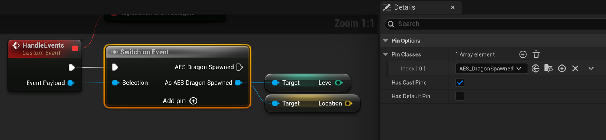

## 5. Generate the Event 📨

In our `Dragon` class, on `Begin Play` we generate an `Identity` for the dragon and then we call `Generate Event`.

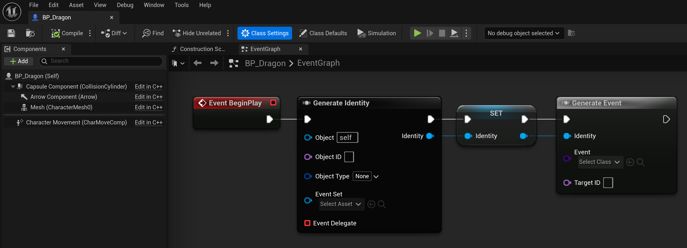

?>**NOTE**: We leave the `Target ID` as blank because we want this event to be broadcasted to all listeners.  For more information about the `Generate Event` and `Broadcast` vs `Whisper` events see [Terminology > Generation](./terms/generate.md).

As soon as the `AES_DragonSpawned` event is selected, any `Instance Editable` and `Expose on Spawn` properties will automatically generate pins allowing us to set the values before the event is broadcasted.

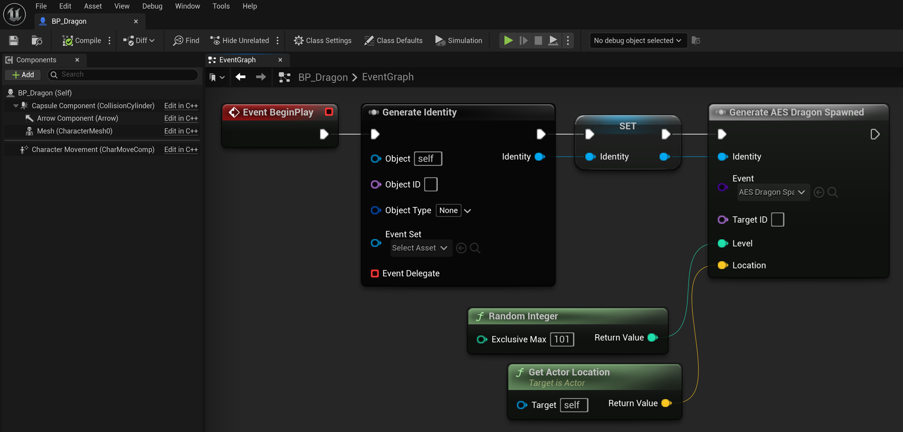

## 6. Spawn the Dragon! 🐲

This spawning would obviously be handled by whatever system you have in place that's responsible for spawning the dragon. 

For demo purposes, in our `BP_DragonSlayer` character we add a simple `Print String` so we can see our event when it gets called.

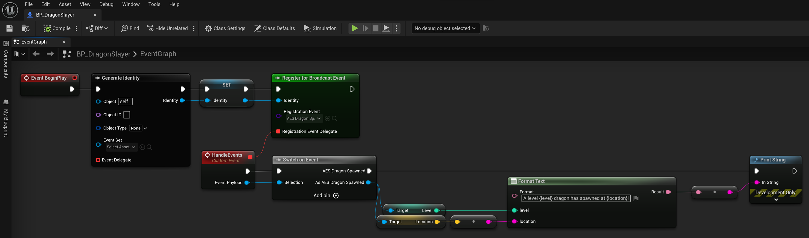

Since we're playing as a `Server`, we can just hardcode a keypress to spawn a `BP_Dragon` on demand.

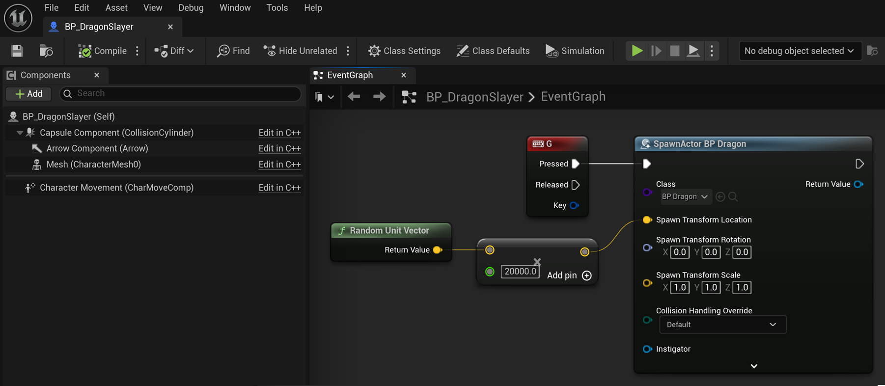

Now when we press `G` we'll see our `BP_Dragon` is being spawned and on `Begin Play` since its generating a random level our `AES_DragonSpawned` event gets called with the `Level` and `Location` payload that we passed in earlier and our `BP_DragonSlayer` character is hearing the event and seeing the data correctly!

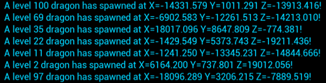

Now we say `GG` in the chat as all of these dragons head to the nearest town for a good ol' barbecue! 🥩🔥