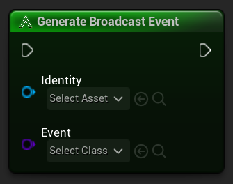
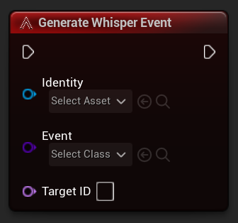

There are 2 custom nodes that can be used to generate events from any object that has an `Identity`.

The minimum requirements to generate an event include the following:

- `Identity` - required by any object that wishes to communicate with the `AES` subsystem.
- `Event` - the `AES Event` to instance, populate with a payload if applicable, and broadcast.

## Generate Broadcast Event

The `Generate Broadcast Event` will execute any delegates that were registered by using any one of the following nodes:

- Register for **[Broadcast Event](/terms/register.md)**
- Register for **[Type Event](/terms/register.md#type-registrations)**
- Reigster for **[Focus Event](/terms/register.md#focus-registrations)**

When an event is `Broadcasted`, the `AES Event Manager` will run through all the registrations for `Broadcasts`, `Type` and `Focus` events since any of the following criteria could be met:

- There are objects listening for an event **of a certain type** (the broadcaster doesn't matter)
- There are objects listening for an event from a **specific object type** (the broadcaster could be of that type)
- There are objects listening for an event from a **specific object ID** (the broadcaster could have that ID)

!> **WARNING**: Be careful when registering for events! If you register for a **Broadcast**, **Type** and **Focus** for the same `AES Event` and a broadcaster broadcasts that event and matches all 3 criteria, your object that is listening for that event will run its delegate 3 times!

## Generate Whisper Event

The `Generate Whisper Event` will execute any delegates that were registered by using the Register for [Whisper Event](/terms/register.md).

?> **NOTE**: If the object with a matching ID is not listening for whisper events, the delegate on that target object will not be called.