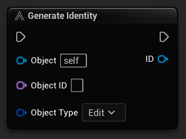

?> **NOTE**: An `Identity` is ***required*** on any object that wants to communicate with the `AES Manager`.

### **Object**

The `Object` that this `Identity` belongs to. This object is stored in the `Identity` and can be fetched from an event payload when events are called.

### **Object ID**
Not to be confused with `Identity`, this `ID` is the unique identifier *for* the `Identity`. This can be a player username or it could be the name of a system like `Inventory`, `Crafting`, `Farming` or whatever other system you have in place.

If the `Object ID` is left blank, a random unique `GUID` is automatically generated for you and assigned to the `Identity` of this object. 

This ID is used for Focus and Message event registration where you can register to listen for events from a specific object. In order to identify which object we want to listen to events from, we have to know their `Object ID` - hence why this field is exposed. It allows you to override the default behavior of how this Object ID is generated and assign your own unique naming to individual objects should you choose to do so.

?> **NOTE**: If this is run on the `Server` as well as the `Client`, the unique ID will differ do to each side of the wire generating it's own unique GUID.   See ["FAQ - Is this replicated" for more details.](../faq.md/#is-this-replicated).

!> **WARNING**: **Do not reuse the same Object ID multiple times** otherwise all the bindings of the first Object will be overidden by the new Object that is using that same ID.

### **Object Type**

This identifies the type of object by using a single `Gameplay Tag`. This gameplay tag is used to allow objects to register for `Type Events` to allow the object to listen for events from a specific `type` of object. For example a player can register for events that come from any object that has a type of `Animals.Chicken`.

Any time the chicken lays an egg and generates a `New Egg` event, the player will be notified, but if a dragon generates a `New Egg` event, it will be ignored.