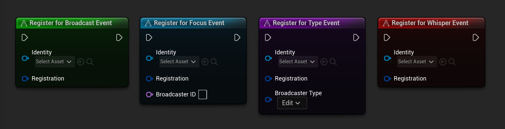
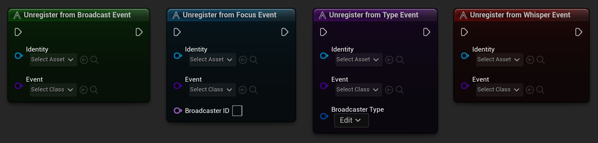
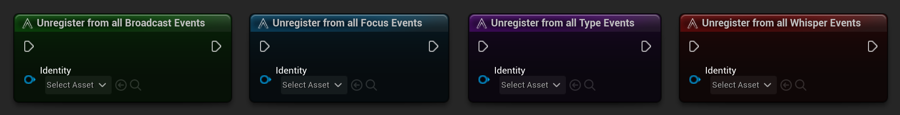

Register nodes are `static functions` that allow an object to register for any type of event from anywhere at any time.

The minimum requirements to register for any type of events include the following:

- `Identity` - this is required by any object that wishes to communicate with the `AES` subsystem.
- `Registration` - this is a struct that lets the subsystem know **which event** to listen for and **what delegate** to call when the event oocurs.

!> **WARNING**: If you pass in an empty `Identity`, or if the `Registration` doesn't have a valid `AES Event` or `Delegate Binding`, the registration will be ignored.

Additionally, `Focus` and `Type` registrations require more information in order to complete the registration.

## Focus Registrations

- `Broadcaster ID` - this is the unique ID that is generated when the `Generate Identity` method is called on an Object. This allows us to listen to a specific object with a matching ID.

!> **WARNING**: If you pass in an empty `Broadcaster ID`, the registration will be ignored. 

## Type Registrations

- `Broadcaster Type` - this is the `Gameplay Tag` that is assigned when the `Generate Identity` method is called on an Object. This allows us to listen to objects that have a matching type.

?> **TIP**: If an object is already registered to an event and it registers for the same event again, the new registration will overwrite the previous registration.

!> **WARNING**: If you pass in an empty `Gameplay Tag`, the registration will be ignored.

---

# Unregister

All registration types have a matching Unregister node as well with the exact same requirements as inputs.

There are matching `Unregister from All` nodes as well that will force the subsystem to remove the passed in `Identity` from all events that it has registered for since the `Identity` was created. You can re-register for the same events after you've unregistered.

